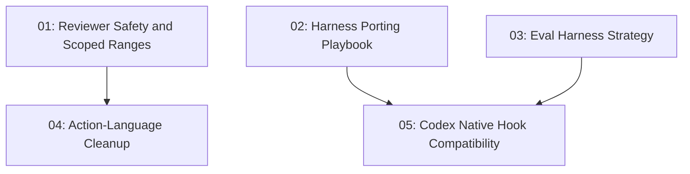

# Superpowers Dev Port Review

## Overview

Selectively port the useful ideas from `obra/superpowers@dev` into `s-kit` without merging the branch wholesale. The work prioritizes safer review agents, harness-porting documentation, eval strategy, action-language cleanup, and Codex native hook compatibility.

## Quick Links

- [Requirements](./requirements.md) — full requirements and acceptance criteria
- [Design](../../design/2026-06-01-superpowers-dev-port/design.md) — approved solution shape and decisions
- [Action Required](./action-required.md) — manual steps needing human action
- [Manifest](./spec.json) — machine-readable orchestration contract
- [Implementation Log](./implementation-log.md) — append-only execution and review record

## Dependency Graph

## Phases

| Phase | Tasks | Description |
|------|-------|-------------|
| 1 | task-01, task-02, task-03 | Independent safety, documentation, and eval-strategy groundwork |
| 2 | task-04 | Shared skill prose cleanup after reviewer prompt safety is in place |
| 3 | task-05 | Codex hook compatibility work after playbook and eval strategy clarify constraints |

## Task Status

### Phase 1

- [x] [task-01-reviewer-safety-scoped-ranges](./tasks/task-01-reviewer-safety-scoped-ranges.md) — Reviewer safety and scoped ranges
- [x] [task-02-harness-porting-playbook](./tasks/task-02-harness-porting-playbook.md) — Harness porting playbook
- [x] [task-03-eval-harness-strategy](./tasks/task-03-eval-harness-strategy.md) — Eval harness strategy

### Phase 2

- [x] [task-04-action-language-cleanup](./tasks/task-04-action-language-cleanup.md) — Action-language cleanup

### Phase 3

- [x] [task-05-codex-native-hooks](./tasks/task-05-codex-native-hooks.md) — Codex native hook compatibility
