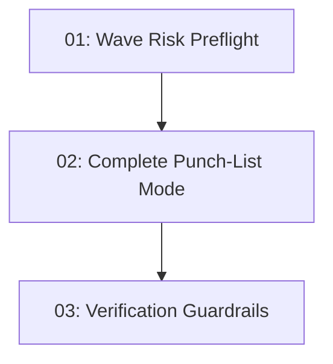

# Build Feature Risk Preflight

## Overview

Add a lightweight risk preflight to `build-feature` so integration-sensitive waves expose shared contracts before coder dispatch, then broaden repeated same-boundary failures into one complete punch-list review instead of several narrow review/fix loops.

## Quick Links

- [Requirements](./requirements.md) - full requirements and acceptance criteria
- [Design](../../design/2026-06-09-build-feature-risk-preflight/design.md) - approved solution shape and decisions
- [Action Required](./action-required.md) - manual steps needing human action
- [Manifest](./spec.json) - machine-readable orchestration contract
- [Implementation Log](./implementation-log.md) - append-only execution and review record

## Dependency Graph

## Waves

| Wave | Tasks | Description |
|------|-------|-------------|
| 1 | task-01 | Add wave risk preflight orchestration and pass its context into coder and review prompts |
| 2 | task-02 | Add complete punch-list behavior for repeated same-boundary failures and targeted simplification guidance |
| 3 | task-03 | Add workflow verification coverage for the new prompt and orchestration contract |

## Task Status

### Wave 1

- [x] [task-01-wave-risk-preflight](./tasks/task-01-wave-risk-preflight.md) - Wave risk preflight

### Wave 2

- [x] [task-02-complete-punch-list-mode](./tasks/task-02-complete-punch-list-mode.md) - Complete punch-list mode

### Wave 3

- [ ] [task-03-verification-guardrails](./tasks/task-03-verification-guardrails.md) - Verification guardrails
