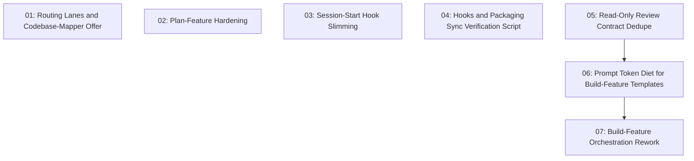

# Workflow Optimization Bundle

## Overview

A balanced optimization pass over s-kit's core workflow: a conservative token diet for build-feature prompts (design digest for coders, preflight to reviewers/fixers only, one-line completed-task summaries, slimmed final review), documented small-change lanes in using-s-kit, wiring for the three orphaned agents (codebase-mapper, pattern-mapper, security-auditor), single-sourcing of the read-only review contract, a hooks/packaging sync verification script, a slimmed session-start hook, and handoff validations (design-path check, baseline verification, no-op semantics, task-reopen cascade). The two-stage review gate and the dated-artifact model are untouched.

## Quick Links

- [Requirements](./requirements.md) — full requirements and acceptance criteria
- [Design](../../design/2026-06-10-workflow-optimization-bundle/design.md) — approved solution shape and decisions
- [Action Required](./action-required.md) — manual steps needing human action
- [Manifest](./spec.json) — machine-readable orchestration contract
- [Implementation Log](./implementation-log.md) — append-only execution and review record

## Dependency Graph

## Waves

| Wave | Tasks | Description |
|------|-------|-------------|
| 1 | task-01, task-02, task-03, task-04, task-05 | Independent edits: lane routing + mapper offers, plan-feature hardening, session-start slimming, verify-hooks script, read-only contract dedupe |
| 2 | task-06 | Prompt token diet across the three build-feature templates plus matching verify-workflow invariants |
| 3 | task-07 | Build-feature SKILL.md orchestration rework reconciled with the dieted templates and verify-workflow invariants |

## Task Status

### Wave 1
- [x] [task-01-routing-lanes-and-mapper-offer](./tasks/task-01-routing-lanes-and-mapper-offer.md) — Lane table in using-s-kit, reroute note and codebase-mapper offer in brainstorming
- [x] [task-02-plan-feature-hardening](./tasks/task-02-plan-feature-hardening.md) — Design-existence hard check, execution-only status annotation, pattern-mapper offer
- [x] [task-03-session-start-slimming](./tasks/task-03-session-start-slimming.md) — Replace full SKILL.md injection with a short pointer
- [x] [task-04-verify-hooks-script](./tasks/task-04-verify-hooks-script.md) — verify-hooks.ps1 sync/version checks wired into npm test
- [x] [task-05-read-only-contract-dedupe](./tasks/task-05-read-only-contract-dedupe.md) — Single-source the read-only review contract

### Wave 2
- [ ] [task-06-prompt-token-diet](./tasks/task-06-prompt-token-diet.md) — Design digest for coders, preflight removal, reviewer task excerpts

### Wave 3
- [ ] [task-07-build-feature-orchestration-rework](./tasks/task-07-build-feature-orchestration-rework.md) — Baseline check, digest dispatch, security-auditor trigger, no-op semantics, slim final review, reopen cascade
