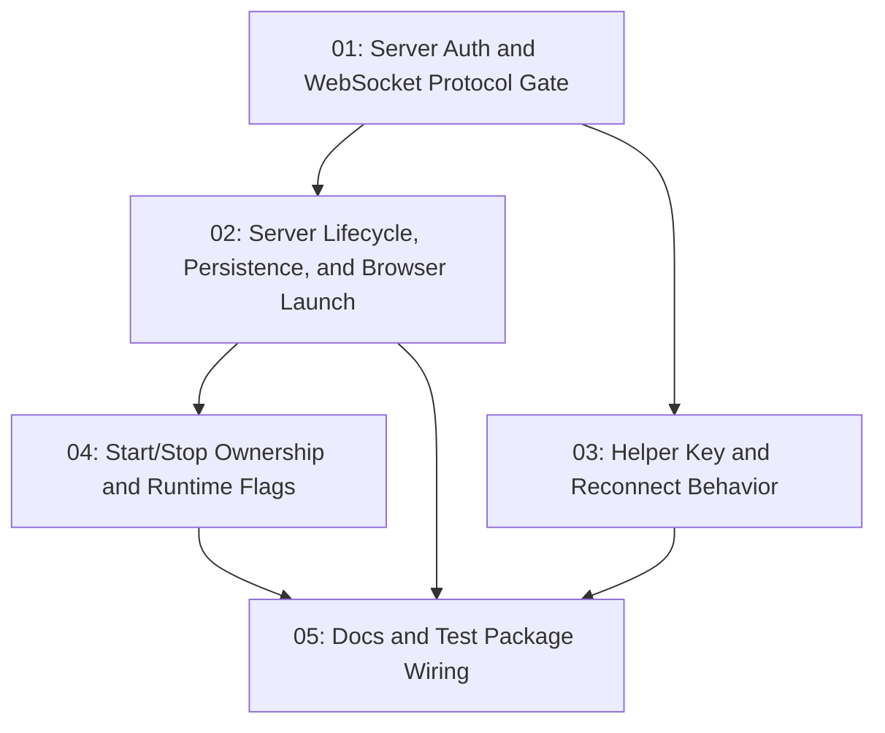

# Brainstorm Companion Hardening

## Overview

Harden the brainstorming visual companion by selectively adapting recent Superpowers companion security, lifecycle, and test improvements into `s-kit`. The feature keeps `.s-kit/brainstorm/` as the persistent session root while adding per-session access keys, WebSocket gates, safer lifecycle shutdown, Windows-aware launcher behavior, expanded tests, and focused docs.

## Quick Links

- [Requirements](./requirements.md) - full requirements and acceptance criteria
- [Design](../../design/2026-06-14-brainstorm-companion-hardening/design.md) - approved solution shape and decisions
- [Action Required](./action-required.md) - manual steps needing human action
- [Manifest](./spec.json) - machine-readable orchestration contract
- [Implementation Log](./implementation-log.md) - append-only execution and review record

## Dependency Graph

## Phases

| Phase | Tasks | Description |
|------|-------|-------------|
| 1 | task-01 | Add the server-side auth gate and WebSocket protocol limits that all later companion behavior relies on |
| 2 | task-02, task-03 | In parallel, finish server lifecycle/persistence/browser behavior and update the injected browser helper |
| 3 | task-04 | Adapt start/stop shell scripts to the hardened server contract and add ownership-safe shutdown tests |
| 4 | task-05 | Wire the expanded test package and update user-facing visual companion docs |

## Task Status

### Phase 1
- [x] [task-01-server-auth-websocket-gate](./tasks/task-01-server-auth-websocket-gate.md) - Server auth, security headers, WebSocket auth/origin checks, frame cap

### Phase 2
- [x] [task-02-server-lifecycle-persistence-browser](./tasks/task-02-server-lifecycle-persistence-browser.md) - Idle shutdown, port/token persistence, safe browser launcher
- [x] [task-03-helper-key-reconnect](./tasks/task-03-helper-key-reconnect.md) - Helper session key handling and reconnect UX

### Phase 3
- [x] [task-04-start-stop-ownership-flags](./tasks/task-04-start-stop-ownership-flags.md) - Launcher flags, `.s-kit` persistent state, server instance id, safe stop

### Phase 4
- [x] [task-05-docs-test-wiring](./tasks/task-05-docs-test-wiring.md) - Nested test script, root targeted script, visual companion docs
