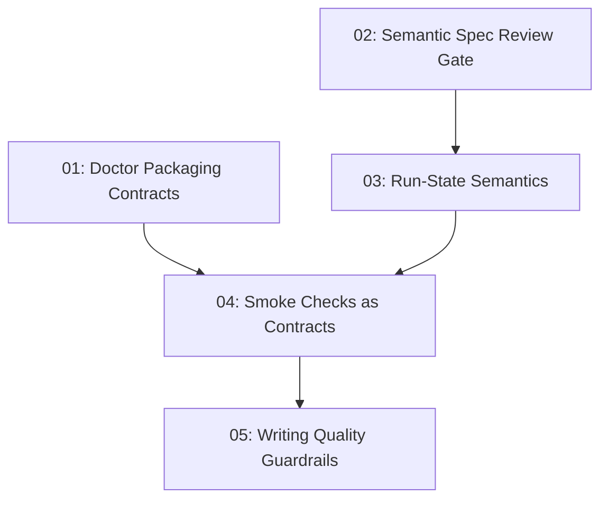

# Workflow Lessons Hardening

## Overview

This spec pulls the useful lessons from locally copied comparable tools into `s-kit` without changing the core dated design/spec/build flow. It strengthens packaging contracts, semantic spec review, run-state language, smoke checks, and writing-quality guardrails through existing scripts, skills, agents, and docs.

## Quick Links

- [Requirements](./requirements.md) - full requirements and acceptance criteria
- [Design](../../design/2026-06-16-workflow-lessons-hardening/design.md) - approved solution shape and decisions
- [Action Required](./action-required.md) - manual steps needing human action
- [Manifest](./spec.json) - machine-readable orchestration contract
- [Implementation Log](./implementation-log.md) - append-only execution and review record

## Dependency Graph

## Waves

| Wave | Tasks | Description |
|------|-------|-------------|
| 1 | task-01, task-02 | Strengthen independent confidence gates for packaging and semantic spec review. |
| 2 | task-03 | Add run-state semantics after spec-review routing is clear. |
| 3 | task-04 | Document smoke checks once doctor and run-state contracts are explicit. |
| 4 | task-05 | Add writing-quality guardrails after the core workflow language is updated. |

## Task Status

### Wave 1
- [x] [task-01-doctor-packaging-contracts](./tasks/task-01-doctor-packaging-contracts.md) - Doctor packaging contracts
- [x] [task-02-semantic-spec-review-gate](./tasks/task-02-semantic-spec-review-gate.md) - Semantic spec review gate

### Wave 2
- [x] [task-03-run-state-semantics](./tasks/task-03-run-state-semantics.md) - Run-state semantics

### Wave 3
- [x] [task-04-smoke-checks-as-contracts](./tasks/task-04-smoke-checks-as-contracts.md) - Smoke checks as contracts

### Wave 4
- [x] [task-05-writing-quality-guardrails](./tasks/task-05-writing-quality-guardrails.md) - Writing quality guardrails
