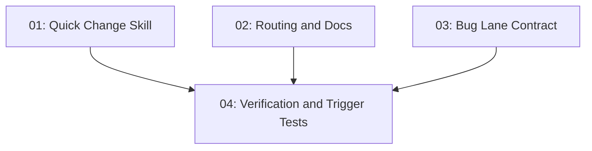

# Quick and Bug Workflows

## Overview

Add a scale-aware quick-change lane and tighten the existing bug-fix lane so `s-kit` can handle small, clear work without entering the dated design/spec workflow, while still preserving root-cause-first debugging and verified completion for defects.

## Quick Links

- [Requirements](./requirements.md) - full requirements and acceptance criteria
- [Design](../../design/2026-06-17-quick-and-bug-workflows/design.md) - approved solution shape and decisions
- [Action Required](./action-required.md) - manual steps needing human action
- [Manifest](./spec.json) - machine-readable orchestration contract
- [Implementation Log](./implementation-log.md) - append-only execution and review record

## Dependency Graph

## Phases

| Phase | Tasks | Description |
|------|-------|-------------|
| 1 | task-01, task-02, task-03 | Add the new quick-change skill, update user-facing routing docs, and tighten the bug lane contract in parallel |
| 2 | task-04 | Update verifiers and trigger tests once the routed skill and lane text exist |

## Task Status

### Phase 1
- [x] [task-01-quick-change-skill](./tasks/task-01-quick-change-skill.md) - Add a first-class `quick-change` skill for small scoped edits
- [x] [task-02-routing-and-docs](./tasks/task-02-routing-and-docs.md) - Update the router and README workflow documentation
- [x] [task-03-bug-lane-contract](./tasks/task-03-bug-lane-contract.md) - Make the bug workflow composition explicit in `systematic-debugging`

### Phase 2
- [x] [task-04-verification-and-trigger-tests](./tasks/task-04-verification-and-trigger-tests.md) - Add canonical skill, workflow, doctor, and trigger-test coverage
