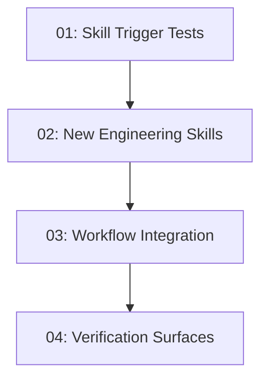

# Engineering Skills Integration

## Overview

Integrate selected engineering practices from Matt Pocock's skills into `s-kit` by adding first-class supporting skills for domain modeling, codebase design, and prototyping, then wiring those skills into the existing dated design/spec workflow without replacing it.

## Quick Links

- [Requirements](./requirements.md) - full requirements and acceptance criteria
- [Design](../../design/2026-06-20-engineering-skills-integration/design.md) - approved solution shape and decisions
- [Action Required](./action-required.md) - manual steps needing human action
- [Manifest](./spec.json) - machine-readable orchestration contract
- [Implementation Log](./implementation-log.md) - append-only execution and review record

## Dependency Graph

## Phases

| Phase | Tasks | Description |
|------|-------|-------------|
| 1 | task-01-skill-trigger-tests | Add failing trigger/explicit-request coverage for the new skills. |
| 2 | task-02-new-engineering-skills | Add the three new supporting skill folders and references. |
| 3 | task-03-workflow-integration | Wire the new skills into README and existing workflow skills. |
| 4 | task-04-verification-surfaces | Update verifiers/catalog expectations and run project checks. |

## Task Status

### Phase 1
- [x] [task-01-skill-trigger-tests](./tasks/task-01-skill-trigger-tests.md) - Skill Trigger Tests

### Phase 2
- [x] [task-02-new-engineering-skills](./tasks/task-02-new-engineering-skills.md) - New Engineering Skills

### Phase 3
- [x] [task-03-workflow-integration](./tasks/task-03-workflow-integration.md) - Workflow Integration

### Phase 4
- [x] [task-04-verification-surfaces](./tasks/task-04-verification-surfaces.md) - Verification Surfaces
