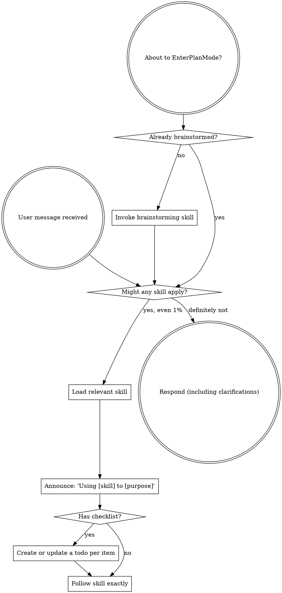

<SUBAGENT-STOP>
If you were dispatched as a subagent to execute a specific task, skip this skill.
</SUBAGENT-STOP>

<EXTREMELY-IMPORTANT>
If you think there is even a 1% chance a skill might apply to what you are doing, you ABSOLUTELY MUST invoke the skill.

IF A SKILL APPLIES TO YOUR TASK, YOU DO NOT HAVE A CHOICE. YOU MUST USE IT.

This is not negotiable. This is not optional. You cannot rationalize your way out of this.
</EXTREMELY-IMPORTANT>

## Instruction Priority

s-kit skills override default system prompt behavior, but **user instructions always take precedence**:

1. **User's explicit instructions** (CLAUDE.md, GEMINI.md, AGENTS.md, direct requests) — highest priority
2. **s-kit skills** — override default system behavior where they conflict
3. **Default system prompt** — lowest priority

If CLAUDE.md, GEMINI.md, or AGENTS.md says "don't use TDD" and a skill says "always use TDD," follow the user's instructions. The user is in control.

## How to Access Skills

**In Claude Code:** Use the `Skill` tool. When you invoke a skill, its content is loaded and presented to you—follow it directly. Never use the Read tool on skill files.

**In Copilot CLI:** Use the `skill` tool. Skills are auto-discovered from installed plugins. The `skill` tool works the same as Claude Code's `Skill` tool.

**In Gemini CLI:** Skills activate via the `activate_skill` tool. Gemini loads skill metadata at session start and activates the full content on demand.

**In other environments:** Check your platform's documentation for how skills are loaded.

## Canonical Workflow

For creative or behavior-changing work, the default path is:

```text
brainstorming -> plan-feature -> build-feature -> verification/review -> ship-it
```

- `brainstorming` is the front door. It explores intent, presents a design, offers optional `grill-me`, waits for approval, then writes `docs/design/YYYY-MM-DD-{feature-name}/design.md`.
- `grill-with-docs` is optional before or during `brainstorming` when a plan needs project-language, `CONTEXT.md`, ADR, bounded-context, or code-backed terminology pressure. It supports design approval; it does not replace the dated design/spec workflow.
- `domain-modeling` handles active glossary and ADR maintenance when terminology itself needs to change. `codebase-design` supplies architecture vocabulary for module interfaces and seams. `prototype` is a throwaway design detour when a runnable answer is needed before approval.
- `plan-feature` only runs from an approved design. It expands that design into the matching `docs/specs/YYYY-MM-DD-{feature-name}/` folder with `spec.json`, `implementation-log.md`, requirements, and self-contained task files.
- `build-feature` only runs from a spec folder and its matching approved design. It executes task Phases, runs spec-compliance review before code-quality review, and updates `spec.json`, task files, README checkboxes, and the implementation log.

## Domain Docs Contract

When a repo has `CONTEXT.md`, `CONTEXT-MAP.md`, or `docs/adr/`, treat those files as binding language and decision inputs. Use glossary terms in designs, specs, task files, hypotheses, test names, review findings, and PR descriptions.

`CONTEXT.md` is a glossary, not a spec. Do not put behavior, implementation steps, or requirements there. If required language is missing or conflicts, use `domain-modeling` or `grill-with-docs` before locking the wording.

If implementation would contradict an ADR, surface the conflict explicitly instead of silently overriding it.

## Lanes

Not every change needs the full dated design/spec ceremony. Pick the lane by the nature of the change:

| Lane | Criteria | Path |
|------|----------|------|
| Quick change | Clear requested outcome, low blast radius, roughly 1-3 files, no design decision, direct verification available | `quick-change` -> `verification-before-completion` |
| Full feature | New behavior, multi-file change, or any change needing design decisions | `brainstorming` -> `plan-feature` -> `build-feature` |
| Bug fix | Defect with reproducible wrong behavior, failed command, failing test, regression, or production issue | `systematic-debugging` -> `test-driven-development` -> `verification-before-completion` |
| Refactor / docs | No behavior change | refactor or direct edit -> `verification-before-completion` |
| Delivery | Committed work ready to push, describe, and open or update for review | `verification-before-completion` -> `ship-it` |
| Hotfix | Urgent production defect | bug-fix lane with user-approved expedited review; log a follow-up for the skipped steps |

Small-lane changes skip the dated spec folder. The audit trail is the commit plus the verification evidence those skills already require.

Boundary rules:

- If a quick change reveals design questions, unclear ownership, or wider blast radius, stop and route to `brainstorming`.
- If a quick change is actually broken behavior, route to `systematic-debugging` even when the expected code diff is small.
- If a bug fix grows beyond roughly 3 files or requires architecture decisions, stop and route to `brainstorming` or an architecture-focused skill after documenting the debugging evidence.
- If a design depends on glossary changes or context boundaries, use `domain-modeling` or `grill-with-docs` before locking the design.
- If a design depends on module seams, test surfaces, or deepening shallow interfaces, use `codebase-design`.
- If a design question needs runnable evidence, use `prototype` and capture the verdict before `plan-feature`.
- When in doubt, use the full feature lane.

Delivery routing boundaries:

- Use `ship-it` for full delivery intent, including "ship it", "create a PR", "open a pull request", "push and PR", or "prepare this for review".
- Use `gh-cli` for explicit GitHub CLI work outside full delivery, such as Actions checks, issue management, releases, repository settings, or `gh api`.
- Use `azure-devops-cli` for explicit Azure DevOps CLI work outside full delivery, such as pipelines, work items, variable groups, branch policies, or direct `az devops` operations.

## Platform Adaptation

Shared skill prose should describe actions: load a skill, create or update a todo, dispatch a subagent, read a file, edit a file, run a shell command, open a browser, or inspect a diff. Keep runtime-specific tool names in this section or in the mapping files under `references/`.

For platform-specific equivalents, see `references/copilot-tools.md` (Copilot CLI), `references/codex-tools.md` (Codex), and `references/gemini-tools.md` (Gemini CLI). Gemini CLI users get the tool mapping loaded automatically via GEMINI.md.

# Using Skills

## The Rule

**Invoke relevant or requested skills BEFORE any response or action.** Even a 1% chance a skill might apply means that you should invoke the skill to check. If an invoked skill turns out to be wrong for the situation, you don't need to use it.



## Red Flags

These thoughts mean STOP—you're rationalizing:

| Thought | Reality |
|---------|---------|
| "This is just a simple question" | Questions are tasks. Check for skills. |
| "I need more context first" | Skill check comes BEFORE clarifying questions. |
| "Let me explore the codebase first" | Skills tell you HOW to explore. Check first. |
| "I can check git/files quickly" | Files lack conversation context. Check for skills. |
| "Let me gather information first" | Skills tell you HOW to gather information. |
| "This doesn't need a formal skill" | If a skill exists, use it. |
| "I remember this skill" | Skills evolve. Read current version. |
| "This doesn't count as a task" | Action = task. Check for skills. |
| "The skill is overkill" | Simple things become complex. Use it. |
| "I'll just do this one thing first" | Check BEFORE doing anything. |
| "This feels productive" | Undisciplined action wastes time. Skills prevent this. |
| "I know what that means" | Knowing the concept ≠ using the skill. Invoke it. |

## Skill Priority

When multiple skills could apply, use this order:

1. **Process skills first** (brainstorming, debugging) - these determine HOW to approach the task
2. **Implementation skills second** (frontend-design, mcp-builder) - these guide execution

"Let's build X" → brainstorming first, then implementation skills.
"Fix this bug" → debugging first, then domain-specific skills.

## Skill Types

**Rigid** (TDD, debugging): Follow exactly. Don't adapt away discipline.

**Flexible** (patterns): Adapt principles to context.

The skill itself tells you which.

## User Instructions

Instructions say WHAT, not HOW. "Add X" or "Fix Y" doesn't mean skip workflows.
